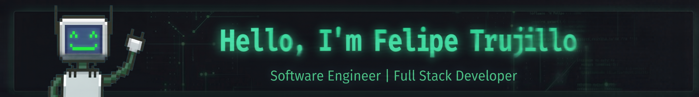

CS student at Florida International University, building full-stack applications and infrastructure. Currently seeking **Summer 2027 SWE internships**.

## About

- BS Computer Science @ Florida International University — GPA 3.72, expected December 2027
- Project Lead Full Stack Engineer @ INIT Build — directing a 10-developer team through sprint cycles from planning to production
- Previously IT/AV Technician @ FIU, maintaining campus infrastructure

## Tech Stack

  
  
  
  
  
  
  
  
  
  
  
  
  
  

## Featured Projects

### [CORE (Study Planner)](https://trycore.vercel.app/)
`React.js` · `Tailwind CSS` · `Express` · `Node.js` · `SQLite`
Full-stack academic planning platform with 8 RESTful API endpoints, deployed to 20+ campus users. Reduced time spent on schedule planning by 30% via Task Management and Progress Tracking modules.

### ScamAware — 1st Place, HackShells Hackathon
`React.js` · `FastAPI` · `Python` · `Manifest V3`
Scam detection platform covering 4 threat vectors (URL, text, file, phone). Chrome Extension (Manifest V3) intercepts link clicks, page visits, and downloads in real time, integrating VirusTotal and Google Safe Browsing APIs for risk verdicts.

### Self-Hosted Home Server / Network Lab
`Linux` · `Docker` · `NGINX`
2-node cluster and NAS running 6 containerized services with 99% uptime via Docker pipelines and NGINX reverse proxies. RAID 1 array cuts hosting costs by $60/month while providing redundant storage.

## Connect

- LinkedIn: [linkedin.com/in/felipetrujillo](https://linkedin.com/in/felipetrujillo)
- Email: felitruavi@gmail.com

## GitHub Stats

  <picture>
    <source media="(prefers-color-scheme: dark)" srcset="https://streak-stats.demolab.com/?user=felipetrujilllo&theme=dark">
    <source media="(prefers-color-scheme: light)" srcset="https://streak-stats.demolab.com/?user=felipetrujilllo&theme=default">
    
  </picture>

